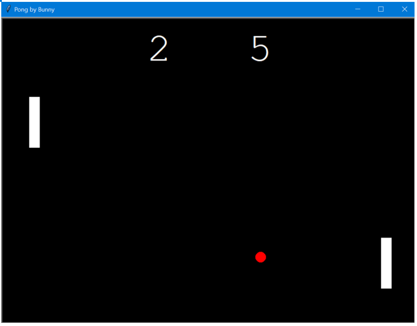

# Pong-Game
bunnysaini/Pong-Game

## Features
A Tkinter GUI supported Pong Table game.

## Instructions to Use
- The right paddle is controlled by 🠐🠑🠓🠒 
- The left paddle is controlled by W(🠑) A(🠐) S(🠒) D(🠓) 
- The ball randomly generates itself on the table after someone on either side loses.
- The ball bounces off the opposite side of who wins.
- One side scores when the other side is unable to hit the paddle.

## Result

